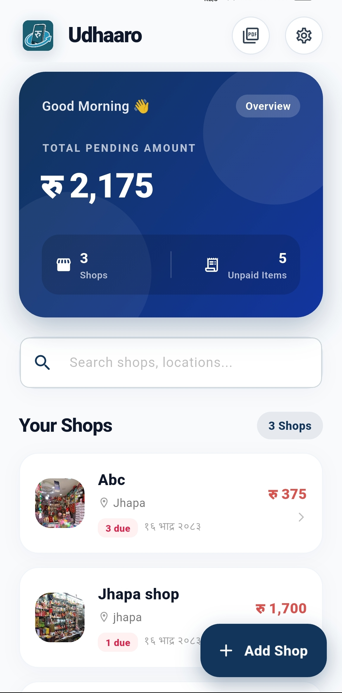
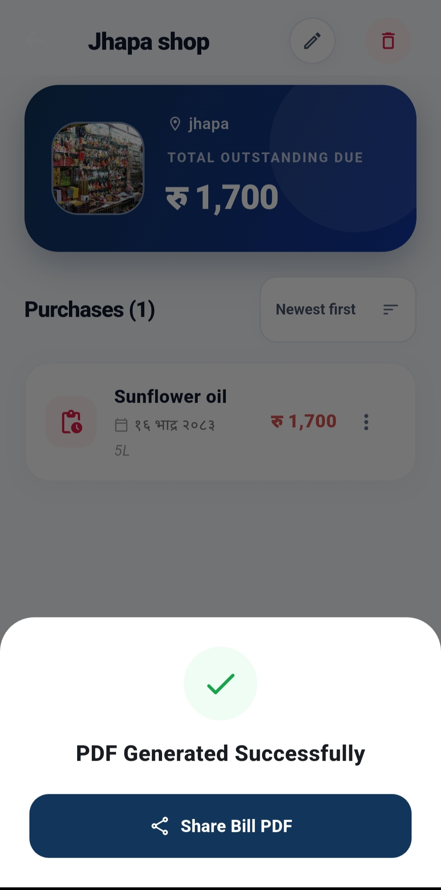
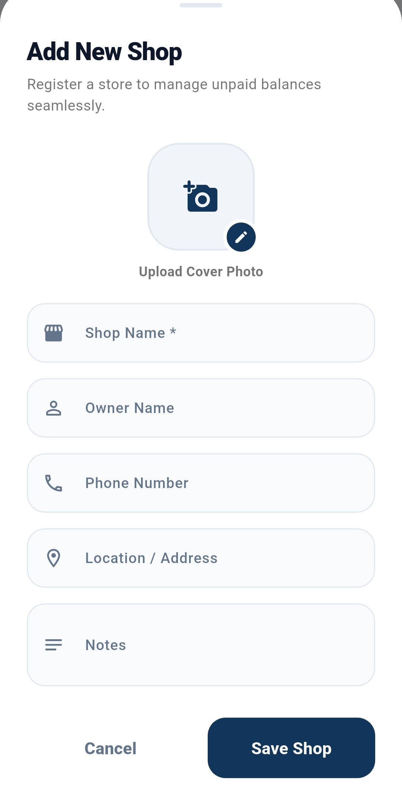
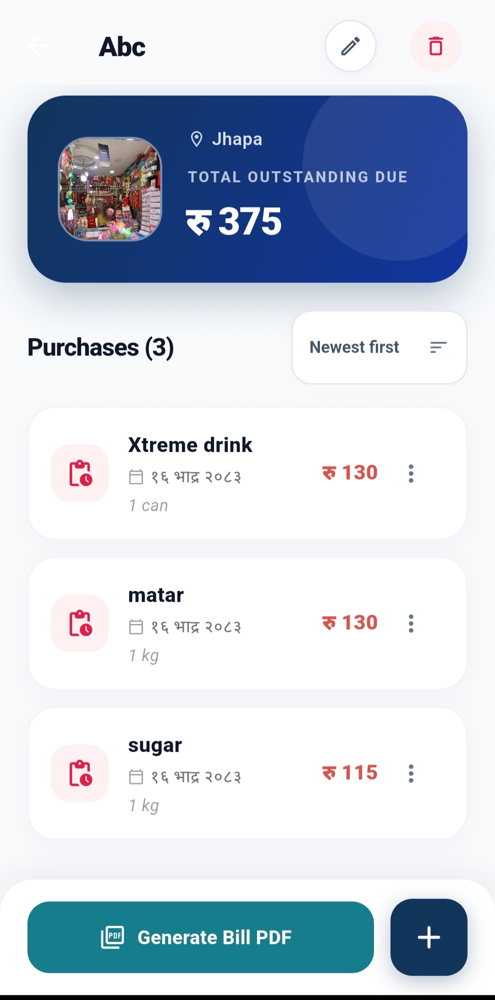
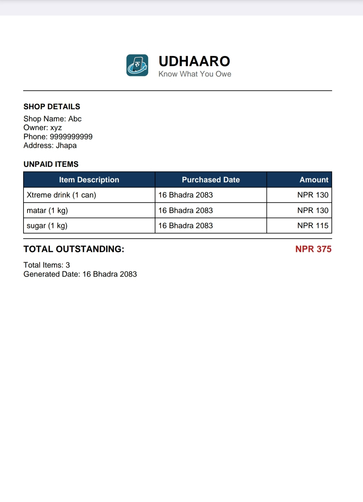

# Udhaaro

### Offline-first Kirana Credit Tracker 🇳🇵

Udhaaro is a Flutter-based Android application designed to help users manage grocery/Kirana credit, unpaid purchases, payments, and outstanding balances digitally.

## ✨ Features

* 🏪 **Shop Management** — Add and manage shop details
* 🛒 **Credit Tracking** — Record grocery purchases and unpaid items
* 💰 **Outstanding Balance** — Track total pending credit
* 💳 **Payment History** — Record and review payments
* 🔔 **Threshold Alerts** — Get notified when outstanding credit exceeds your chosen limit
* ⏰ **Payment Reminders** — Receive scheduled reminders for unpaid balances
* 📄 **PDF Statements** — Generate payment and credit statements
* 💾 **Offline-First** — Store records locally on the device
* 🇳🇵 **NPR Support** — Designed for Nepali currency
* 📱 **Material 3 UI** — Clean and modern Android interface

## 🛠️ Tech Stack

* **Flutter** — Cross-platform UI framework
* **Dart** — Programming language
* **Provider** — State management
* **Hive** — Local database/storage
* **Flutter Local Notifications** — Local notification system
* **PDF** — PDF statement generation

## 🔐 Privacy & Data Storage

Udhaaro is designed as an offline-first application.

User records such as shops, purchases, payments, and balances are stored locally on the user's device and do not depend on an online server.

## 📸 Screenshots

### App Preview

  
  
  
  
  

## 📥 Download

Download and install the latest Android APK:

**[Download Udhaaro v1.0.0](../../releases/latest)**

> Android 8.0+ recommended.

## 📄 License

© 2026 **Nishan Giri**. All rights reserved.

This project is published for portfolio and demonstration purposes only.

The source code may not be copied, modified, redistributed, published, or used in other projects without prior written permission from the author.

The project does not grant any rights to use, reproduce, distribute, or create derivative works from the source code.

## 👨‍💻 Developer

**Nishan Giri**
